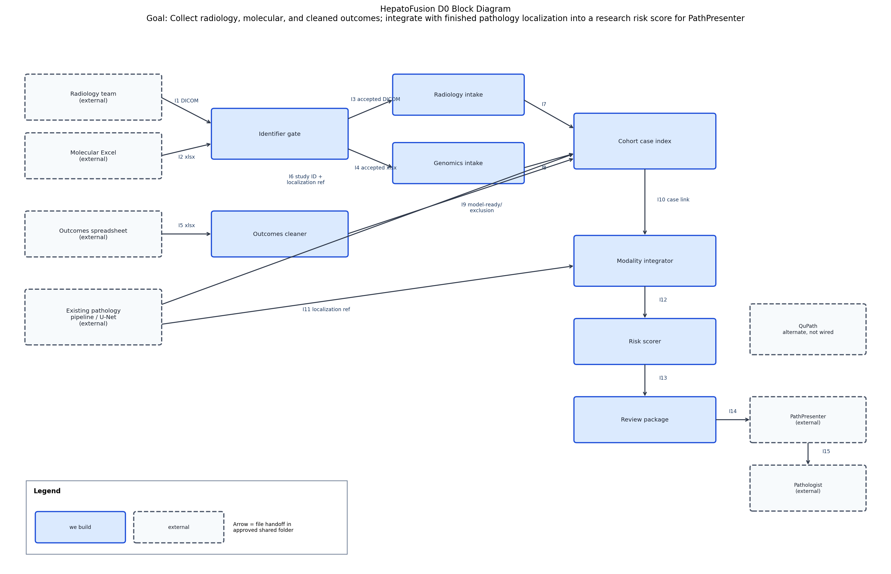
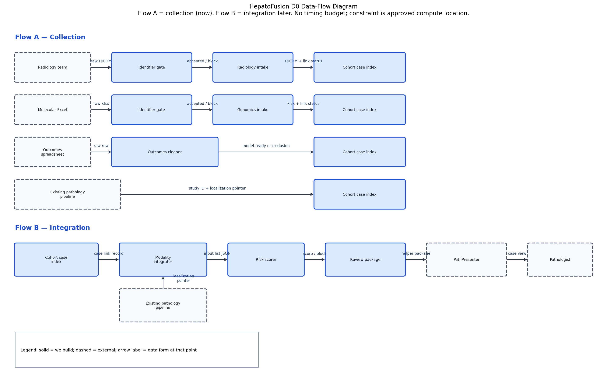

# D0 High-Level Design

**Project:** HepatoFusion  
**Team members:** Shivam Sinay Kharangate, Nipun Chandra  
**Partner:** Cincinnati Children’s Hospital  
**Document:** Design D0 (Week 5). D1 and D2 will sit beside this file.

**AI use.** An AI tool helped draft this document and the text diagrams. The component breakdown, the interface definitions, and the pattern justification are the team's decisions: a file pipeline on approved shared storage, collection before integration, DICOM and Excel as the known formats, joint ownership until modality tasks are assigned, PathPresenter as the first clinical viewer for the finished pathology model, and rejection of microservices and a cloud client-server app.

## Team decisions used in this document

These are the design choices the team made before drafting D0. Later sections follow them.

| Topic | Team decision |
|---|---|
| Architecture pattern | Pipeline. Each stage hands a case folder to the next. |
| What we start now | Radiology intake, genomics intake, and outcomes cleanup. Collection one modality at a time. |
| What the diagram still shows | Full path through modality integration and a research risk score, so the infrastructure has a place to land. |
| Transport | Files in an approved Cincinnati Children’s or UC shared folder. One case folder per study ID. No public API. No consumer cloud. |
| Radiology format | DICOM. Conversion after DICOM is not chosen yet and needs research, so no converter is drawn. |
| Molecular format | Excel (`.xlsx`). Other molecular file types are not finalized and are blocked rather than guessed. |
| Missing radiology or molecular data | Working assumption: still score from the inputs that are linked, and list the missing ones as not linked. Not finalized. |
| Missing model-ready outcomes | Do not score. |
| Ownership | Both teammates on every component for now. Modality tasks will be split later when collection is further along. |
| Existing pathology U-Net | Already built. Not rebuilt in D0. Treated as an external system. First integration target for that model is PathPresenter. QuPath is the other viewer under consideration. |
| Deployment | Not designed in D0. Spring 2027 plan. |
| Rejected patterns | Microservices (too many moving parts, no deployment yet) and a cloud client-server app (would send hospital files through a consumer API). |

## 1. Title, goal statement, and conventions

**Title:** HepatoFusion  

**Goal:** Put an infrastructure in place for radiology, molecular data, and cleaned clinical outcomes on the existing pediatric liver-cancer cohort, then integrate those modalities with the finished pathology localization so a pathologist can use a research risk score as a helper. The finished pathology U-Net is also planned to surface inside PathPresenter (QuPath is the alternative viewer still under consideration), so the localization is available in the systems pathologists already use.

**Basic input and output.** The basic input is one existing cohort case plus the new files collected for it: a DICOM CT or MRI, a molecular Excel file, and the clinical-outcomes spreadsheet. The basic output is a helper package for the pathologist: the tumor localization that the finished pipeline already produced, delivered first through PathPresenter where that integration is available, and a risk score only after integration runs, listing the inputs that were actually used.

The Silver/Gold whole-slide pipeline and its U-Net are already built (1,566+ Silver and 1,546+ Gold annotations, 248+ slides, 102+ patients). D0 does not rebuild them. They appear as an external system. What we are starting now is data collection, one modality at a time. Integration and the risk score are later stages of the same pipeline, drawn here so the infrastructure has a place to land. The first planned software landing for the existing pathology model is PathPresenter. QuPath remains a second option if PathPresenter does not fit. Other modalities may later show up in those tools as well; that is not required for the collection work we are doing first. Deployment is not in this diagram. It is a Spring 2027 plan.

**Conventions** (also drawn on both diagrams below):

- A solid box is a component this team will build.
- A dashed box is an external system or person we depend on and will not build.
- An arrow is a file handed from one box to the next inside an approved Cincinnati Children’s or University of Cincinnati shared folder. There is no public API and no consumer cloud.
- The label on an arrow (I1, I2, …) is the interface ID in section 4.
- One case folder is one study ID. The study ID is the internal cohort key, not a patient name.

## 2. Block diagram

Editable source (open in [diagrams.net](https://app.diagrams.net/)): `D0_diagrams.drawio` (sheet **D0 Block Diagram**).



Components we build (8): Identifier gate, Radiology intake, Genomics intake, Outcomes cleaner, Cohort case index, Modality integrator, Risk scorer, Review package.

External (dashed): Radiology team, Molecular Excel source, Outcomes spreadsheet, Existing pathology pipeline, PathPresenter (primary clinical viewer), QuPath (alternate viewer, not wired yet), Pathologist.

## 3. Component responsibility table

Owners are joint for now. Once collection is further along, each teammate will take modality tasks. That split is not decided in D0.

| Component | Responsibility | Interfaces in | Interfaces out | Primary owner | Story |
|---|---|---|---|---|---|
| Identifier gate | Rejects a newly collected radiology or molecular file when a direct patient identifier is present. | I1, I2 | I3, I4 | Shivam Sinay Kharangate and Nipun Chandra | US-05 |
| Radiology intake | Stores an accepted DICOM study and records whether it links to one cohort case. | I3 | I7 | Shivam Sinay Kharangate and Nipun Chandra | US-03 |
| Genomics intake | Stores an accepted molecular Excel and records whether it links to one cohort case. | I4 | I8 | Shivam Sinay Kharangate and Nipun Chandra | US-02 |
| Outcomes cleaner | Keeps a spreadsheet row only when it joins to exactly one existing pathology case and its agreed fields are ready. | I5 | I9 | Shivam Sinay Kharangate and Nipun Chandra | US-04 |
| Cohort case index | Records, for one study ID, which new files are linked to the existing pathology case. | I6, I7, I8, I9 | I10 | Shivam Sinay Kharangate and Nipun Chandra | US-03, US-04 |
| Modality integrator | Builds the list of inputs actually linked for one case, including the existing pathology localization. | I10, I11 | I12 | Shivam Sinay Kharangate and Nipun Chandra | US-02 |
| Risk scorer | Computes one risk score from that input list. | I12 | I13 | Shivam Sinay Kharangate and Nipun Chandra | US-02 |
| Review package | Packages the existing tumor map and the score result for PathPresenter so a pathologist can use them as a research helper. | I13 | I14 | Shivam Sinay Kharangate and Nipun Chandra | US-01 |

## 4. Interface specification table

Protocol for every row is the same: a file written into that case’s folder on approved Cincinnati Children’s or UC shared storage, except I15, which is a pathologist reading the case inside PathPresenter after I14 has placed the helper files where PathPresenter can open them. Nothing in this table is a consumer-cloud API. Study IDs stand in for patient names.

| ID | From → to | Inputs | Outputs | Data format | Protocol | Error and who handles it |
|---|---|---|---|---|---|---|
| I1 | Radiology team → Identifier gate | DICOM study, study ID | Pass record or block record | DICOM, plus a JSON status file | Approved shared folder, `incoming/` | If the file is not DICOM, or a direct identifier is present (patient name, medical record number, date of birth, street address), the gate leaves it in `incoming/` and does not copy it onward. The status names the field type, not the value. The gate handles this. |
| I2 | Molecular Excel source → Identifier gate | Molecular workbook, study ID | Pass record or block record | `.xlsx`, plus a JSON status file | Approved shared folder, `incoming/` | If the file is not an Excel workbook, the gate blocks it. Other molecular file types are not finalized yet, so they are blocked rather than guessed. Identifier fields are handled as in I1. The gate handles this. |
| I3 | Identifier gate → Radiology intake | Accepted DICOM, study ID, pass record | Linked-study record or unlink record | DICOM in `radiology/`, JSON link status | Approved shared folder, case folder | If the study ID matches zero cohort cases or more than one, intake does not guess a match and writes `status: unmatched`. Intake handles this. Conversion after DICOM is not defined yet and needs research, so intake does not convert the file. |
| I4 | Identifier gate → Genomics intake | Accepted workbook, study ID, pass record | Linked-molecular record or unlink record | `.xlsx` in `molecular/`, JSON link status | Approved shared folder, case folder | Same unmatched rule as I3. Genomics intake handles this. A non-Excel molecular file never arrives here, because I2 already blocked it. |
| I5 | Outcomes spreadsheet → Outcomes cleaner | Source workbook | Model-ready row or exclusion record | `.xlsx` in, one table row out (CSV) | Approved shared folder | If the join key matches zero cases or more than one, or an agreed field is empty or still free text, the cleaner excludes the row, logs `unmatched`, `ambiguous join`, or `field not coded`, and does not invent a match. The cleaner handles this. The log stores the study ID and the field name, not the patient name. |
| I6 | Existing pathology pipeline → Cohort case index | Study ID, pointer to the existing localization | Cohort membership record | JSON pointer. The localization file itself stays where the finished pipeline already stored it. | Approved shared folder, read-only pointer | If the study ID is not in the existing 102+ patient cohort, the index writes `in_cohort: false` and does not create a new patient. The index handles this. |
| I7 | Radiology intake → Cohort case index | Link status for DICOM | Updated case link record | JSON (`linked` or `not_linked` or `unmatched`) | Approved shared folder | If I3 was `unmatched`, the index records radiology as not linked. The index handles this. No score is implied. |
| I8 | Genomics intake → Cohort case index | Link status for the molecular workbook | Updated case link record | JSON (`linked` or `not_linked` or `unmatched`) | Approved shared folder | Same as I7 for the molecular slot. The index handles this. |
| I9 | Outcomes cleaner → Cohort case index | Model-ready row or exclusion reason | Updated case link record | CSV row when kept; JSON exclusion when not | Approved shared folder | An excluded row is stored as `outcomes: not_model_ready` plus the reason from I5. The index handles this. |
| I10 | Cohort case index → Modality integrator | Case link record | The same record, read when integration is run | JSON | Approved shared folder | If the case is not in the cohort, the integrator does not run. The integrator handles this. |
| I11 | Existing pathology pipeline → Modality integrator | Pointer to the finished tumor localization | Localization marked `present` on the input list | JSON pointer | Approved shared folder, read-only | If the pointer does not resolve, the integrator stops and reports `pathology localization missing`. It does not retrain or rebuild the U-Net. The integrator handles this. |
| I12 | Modality integrator → Risk scorer | Input list for one study ID | (see example payload) | JSON | Approved shared folder | If the outcomes slot is `not_model_ready`, the integrator still emits the list, and the scorer must not score (see I13). The scorer handles the refusal. |
| I13 | Risk scorer → Review package | Input list from I12 | One score, or a block reason and no score | JSON | Approved shared folder | If outcomes are not model-ready, the scorer writes `risk_score: null` and the reason `clinical outcomes not model-ready`. If radiology or molecular is `not_linked`, the working assumption (not finalized) is to score the remaining inputs and leave the missing ones off the used-list. The scorer handles this. |
| I14 | Review package → PathPresenter | Score result from I13 plus the localization pointer from the finished U-Net | Helper files PathPresenter can open for that study ID | JSON helper result plus the existing localization overlay or export that PathPresenter accepts | Approved shared folder, then PathPresenter open of those files. Not committed to the course Git repository. | If PathPresenter cannot open the localization export, the review package leaves the files in the case folder and records `viewer_open: failed`. It does not fall back to QuPath automatically in D0. QuPath stays a manual alternate until that choice is made. The review package handles this. The disclaimer is always `research prototype, not a diagnostic device`. |
| I15 | PathPresenter → Pathologist | Case open in PathPresenter with the helper files from I14 | Pathologist review of the tumor map and, when present, the risk score | PathPresenter case view. No new file is written by the pathologist for D0. | Pathologist uses PathPresenter on approved hospital or institutional access. | If I13 blocked the score, PathPresenter still shows the existing tumor map and the block reason, with no score number. The pathologist owns the clinical read. PathPresenter and the review package share this error path. |

### Example payload (I12, the input list handed to the risk scorer)

A case where molecular data and cleaned outcomes are in, and radiology has not been collected yet. No patient name or medical record number.

```json
{
  "study_id": "HF-0102",
  "inputs": [
    {"name": "pathology_localization", "status": "linked", "source": "existing_pipeline"},
    {"name": "radiology", "status": "not_linked", "format": "DICOM"},
    {"name": "molecular", "status": "linked", "format": "xlsx"},
    {"name": "clinical_outcomes", "status": "model_ready"}
  ],
  "viewer_target": "PathPresenter"
}
```

Under the working assumption, a later I13 result for this payload would name pathology, molecular, and clinical outcomes as used, would mark radiology as not linked, and would include the prototype disclaimer. That partial-score rule is not finalized. The localization itself is still intended to open in PathPresenter for US-01, even when radiology is not linked.

## 5. Data-flow diagram

Two flows. They share the case folder, and they are not run as one step. Collection happens per modality now. Integration runs later, when we choose to score a case. The finished pathology model also has a path into PathPresenter so the pathologist can use the localization as a helper.

No user story sets a timing budget. There is no deadline such as a maximum seconds-per-case. The constraint on these flows is where the files live (approved compute, not a personal laptop or the course repository), not a latency number.

Editable source (open in [diagrams.net](https://app.diagrams.net/)): `D0_diagrams.drawio` (sheet **D0 Data-Flow Diagram**).


## 6. Architecture pattern and justification

**Pattern we are using.** A pipeline. Each stage writes a file into the case folder and the next stage reads that file. The same pattern covers the whole system we will build. Flow A is the collection pipeline (gate, then intake or cleaner, then the case index). Flow B is the later pipeline (index, then integrator, then scorer, then review package into PathPresenter). We are not running them as separate products.

**Fit to the problem.** New files arrive one modality at a time, and the finished pathology result is already sitting there. A pipeline lets us store radiology first, molecular next, and outcomes as the spreadsheet is cleaned, then integrate only the slots that are actually linked. PathPresenter is the place the finished U-Net is meant to show up for the pathologist. That matches a research project that is collecting modalities now and integrating into an existing clinical viewer later, rather than building a new front end.

**Team skills.** The team is two people. Shivam’s work has been the pathology and clinical side. Nipun’s work has been data and systems. A file pipeline can be split later by modality without standing up a service per file type. Owners stay joint until that split is real.

**Performance and timing.** User stories set no response-time number. Collection is a batch of files, not a live request. The heavy model, when we train the risk score, stays on approved UC or Cincinnati Children’s compute, the same constraint as the existing U-Net work. A pipeline does not add a network hop that we would then have to budget.

**Scalability.** The cohort is the existing 102+ patients, not an open multi-user service. A case folder per study ID is enough for that size. We do not need independent scaling of each modality.

**Hardware constraints.** Week 3 constraints still hold: protected health information stays off personal machines, off the course Git repository, and off consumer cloud APIs. Training and file storage stay on approved institutional or hospital machines. There is no purchased commercial platform beyond tools already in the hospital workflow, such as PathPresenter. A folder pipeline on that storage fits. Building our own cloud-hosted viewer does not. Looking at broader deployment is a Spring 2027 plan.

**Rejected.** Microservices, with one service per modality. That is more moving parts than a two-person research project can operate, and there is no deployment environment to put those services in yet. Also rejected: a cloud client-server app that a pathologist would log into. That pattern would send slides, DICOM, or outcomes through a consumer API, which the hospital data-use rules and the Week 3 privacy constraint do not allow, and it would rebuild a viewer when PathPresenter is already the first integration target. We did not reject those patterns forever. We rejected them for D0 and for this academic year of research infrastructure.

## 7. Decision log

| ID | Decision | Alternatives considered | Why this one won |
|---|---|---|---|
| D-01 | The system we build is a file pipeline on approved shared storage. | Microservices, one service per modality. A cloud client-server app. | Collection is one modality after another, then a later integration step. Two people cannot operate a service per modality, and deployment is a Spring 2027 question, not this semester’s. A cloud client would move hospital files onto a consumer API, which our constraints forbid. |
| D-02 | D0 draws the full path from collection through a risk score, but the work we start now is collection and cleanup only. | Draw only the three starting pieces (radiology intake, genomics intake, outcomes cleaner). Draw the risk score as if it were being built first. | The infrastructure has to have a place for files to land and a later path into risk stratification. Starting with the score would skip the data collection the radiology conversation and the spreadsheet cleanup actually require. Leaving the later stages off the diagram would hide that path. |
| D-03 | Components hand off files in one case folder per study ID. No HTTP API in D0. | An internal HTTP service. A database on approved compute. | The near-term work is collecting and cleaning files. A service or a database is extra structure before the formats are settled. |
| D-04 | Radiology is stored as DICOM. No conversion stage is drawn. | Convert DICOM to another format now. Leave the radiology format unmarked. | DICOM is the form we expect from the radiology team. What happens after that, including any conversion, still needs research, so drawing a converter would pretend we had chosen one. |
| D-05 | Molecular intake accepts an Excel workbook only. | Accept variant files or other molecular formats in the same component. | The file we know about is Excel. Other molecular forms are not finalized. Unknown forms are blocked at the gate instead of stored under a guessed type. |
| D-06 | A case with no linked radiology or molecular file can still be scored from the inputs that are linked. This is a working assumption, not a final rule. A case whose outcomes row is not model-ready is not scored. | Refuse any score until radiology and molecular data are both present. | Collection will not cover every case at once, and US-02 says a missing modality must not be treated as present. We are not locking the partial-score rule before the model work starts. The outcomes block is already the rule in UC-01, so a score with no model-ready outcomes row would ignore that use case. |
| D-07 | Every component is owned by both teammates until modality tasks are assigned. | Split owners now, with Shivam on the model side and Nipun on intake. | The split will follow the modalities once collection is further along. Naming owners now would freeze a task split we have not made. |
| D-08 | The finished pathology U-Net integrates first into PathPresenter. QuPath stays the alternate viewer and is not wired in D0. | Build a custom viewer. Wire QuPath first. Wire both PathPresenter and QuPath now. | PathPresenter is the hospital-facing system we are aiming at first for the existing localization. QuPath remains available if PathPresenter does not fit. Wiring both now would invent two viewer interfaces before the first one is proven. A custom viewer would ignore tools already in the workflow and push toward a deployed product we have not designed. |
