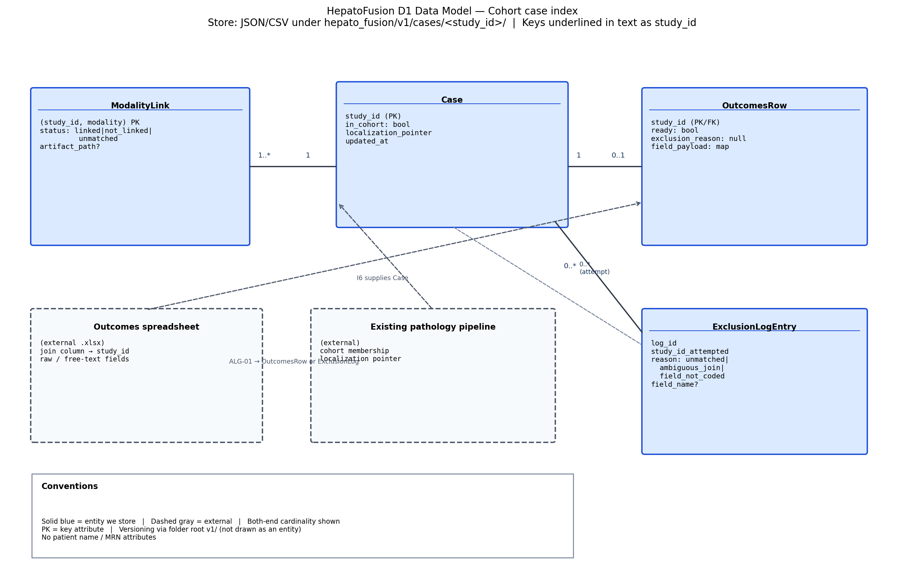

# D1 Detailed Design

**Project:** HepatoFusion  
**Team members:** Shivam Sinay Kharangate, Nipun Chandra  
**Partner:** Cincinnati Children’s Hospital  
**Document:** Design D1 (Week 6). Sits beside `D0_High_Level_Design`. Does not overwrite D0.

**AI use.** An AI tool helped draft this document and the data-model figure. The data model, the outcomes join-and-clean algorithm, the file-schema contract, and the technology justifications are the team's decisions. We can explain them. The tool did not choose them.

## Team decisions used in this document

| Topic | Team decision |
|---|---|
| D1 scope | Detail **Cohort case index** (data model) and **Outcomes cleaner** (core algorithm). |
| Deferred to D2 | Identifier gate, Radiology intake, Genomics intake, Modality integrator, Risk scorer, Review package (and PathPresenter wiring). |
| Store | JSON/CSV case files in the approved shared folder (same as D0). SQL (SQLite/Postgres) is a proposed later migration if joins get hard — not the D1 store. |
| Core algorithm this week | Outcomes join-and-clean only. Starting small while meeting modality leads for radiology/molecular modeling. Risk scoring and PHI gate are real, but not fully specified until D2. |
| “API” for now | No HTTP or callable integration API yet. Contract = versioned JSON/CSV schemas and the validation rules for writing them. |
| Language | Python for these components. |
| Spreadsheet tooling | Reuse **pandas + openpyxl** in the pipeline. **Excel / Microsoft Graph** remains an option for human-side workbook access, not the pipeline store. |
| Versioning | Versioned folder paths (`v1/`, `v2/`). A breaking field rename or remove requires a new folder version. |

---

## 1. Header, scope, and conventions

**Title:** HepatoFusion  

**Goal (same wording as D0):** Put an infrastructure in place for radiology, molecular data, and cleaned clinical outcomes on the existing pediatric liver-cancer cohort, then integrate those modalities with the finished pathology localization so a pathologist can use a research risk score as a helper. The finished pathology U-Net is also planned to surface inside PathPresenter (QuPath is the alternative viewer still under consideration), so the localization is available in the systems pathologists already use.

**Scope.** This D1 document details two D0 components: **Cohort case index** (holds the data model) and **Outcomes cleaner** (the computation that, if wrong, leaves the risk path with unmatched or uncoded rows). Identifier gate, Radiology intake, Genomics intake, Modality integrator, Risk scorer, and Review package are deferred to D2 while the team starts small and meets modality leads for radiology and molecular modeling.

**Conventions for every figure**

- A solid rectangle is an **entity** (or a component we build, when the figure is a component sketch).
- An underlined attribute is a **key** (primary key or natural join key).
- A dashed rectangle is an **external** source or a file that lives outside the component (for example the source outcomes spreadsheet or the existing pathology pipeline).
- A line between entities is a **relationship**. Cardinality is written on both ends using `1`, `0..1`, or `1..*` (crow’s-foot style in the draw.io source).
- Folder path labels such as `v1/` mark the **schema version**, not a patient identifier.
- `study_id` is the internal cohort key. Patient name and medical record number are never attributes in these entities (US-05 / Week 3 privacy).

Editable figure source: `D1_diagrams.drawio` (sheet **D1 Data Model**).



---

## 2. Data model (the D1 diagram)

**Component detailed:** Cohort case index (D0).  
**Store choice:** simpler file store — one case folder per `study_id` under a versioned root (`.../hepato_fusion/v1/cases/<study_id>/`), holding JSON and CSV. Not a relational database in D1. A SQLite or Postgres migration is proposed later if multi-table joins become the bottleneck (see §6 and decision log).

### Entities and key attributes

| Entity | Key attributes (behavior only) | Notes |
|---|---|---|
| **Case** | `study_id` (PK), `in_cohort` (bool), `localization_pointer` (path or null), `updated_at` | One row/object per existing pathology-cohort case (102+ patients). |
| **ModalityLink** | (`study_id`, `modality`) composite key; `status` ∈ {`linked`, `not_linked`, `unmatched`}; `artifact_path` (optional) | `modality` ∈ {`radiology`, `molecular`, `pathology`}. Pathology link is usually filled from the existing pipeline pointer. |
| **OutcomesRow** | `study_id` (PK/FK), `ready` (bool), `exclusion_reason` (null or enum), `field_payload` (coded/numeric map) | Produced by Outcomes cleaner. Only `ready=true` rows are model-ready for later risk work (US-04, UC-02). |
| **ExclusionLogEntry** | `log_id`, `study_id_attempted`, `reason` ∈ {`unmatched`, `ambiguous_join`, `field_not_coded`}, `field_name` (optional) | Audit of rejected spreadsheet rows. Stores study ID and field name, not patient name (I5). |

### Relationships and cardinality

| Relationship | Cardinality | Why |
|---|---|---|
| Case → ModalityLink | **1 → 1..\*** | A case always has modality slots (at least pathology); each link is one modality for that case. Not many-to-many: a modality type does not float free of a case. |
| Case → OutcomesRow | **1 → 0..1** | At most one model-ready (or explicitly not-ready) outcomes object per case after cleaning. Many spreadsheet rows may map to zero cases; those become ExclusionLogEntry, not OutcomesRow. |
| Case → ExclusionLogEntry | **1 → 0..\*** (optional association by attempted id) | Many failed spreadsheet attempts can mention the same study ID; failures are not the outcomes entity. |
| Existing pathology pipeline → Case | **external 1 → 0..1 Case** | Pipeline supplies membership + localization pointer (I6); D1 does not remodel the U-Net. |

### Structural decisions table

| Decision | Choice | Why | Requirement / interface |
|---|---|---|---|
| Case is an entity, not only a folder name | Entity `Case` with `study_id` | Behavior needs `in_cohort` and `localization_pointer`, not just a path string. | US-03, I6, I10 |
| Modality status is an entity/row, not a boolean on Case | `ModalityLink` | Radiology and molecular arrive at different times; packing three statuses into Case attributes would force schema churn each new modality. | US-02, US-03, I7, I8 |
| Exclusion is not an OutcomesRow | Separate `ExclusionLogEntry` | A failed join must not look like a scorable outcomes record. | US-04, UC-02 E1, I5, I9 |
| Outcomes fields are a payload map, not 40 fixed columns in D1 | `field_payload` | Agreed field list is still being cleaned with clinical leads; fixed columns would freeze the spreadsheet too early. Indexed/lookup key remains `study_id`. | US-04 |
| Relationship Case–Outcomes is 1–0..1, not 1–\* | One cleaned object per case | Risk path needs one outcomes slot per case (model_ready or not). Multiple historical spreadsheet imports go through cleaner again or to the exclusion log. | UC-02, I9 |
| Indexed / lookup field | `study_id` | Every join and case-folder open is by study ID. At ~102 cases this is a dictionary/file-name lookup; at 100× still fine for files. | I5–I10 |
| Store | JSON/CSV files under `v1/` | Matches D0 file pipeline and approved shared folders; no DB admin on hospital storage yet. | D0 D-01, D-03 |

---

## 3. Core algorithms

### ALG-01 — Outcomes join-and-clean

**What it is and the problem it solves.**  
Takes the clinical-outcomes spreadsheet and the pathology cohort list, and emits either one model-ready outcomes object per matched case or an exclusion record. Solves US-04 / UC-02: the risk path must not train or score on free-text or unmatched patients.

**Inputs and outputs (exact types).**

| | Type | Notes |
|---|---|---|
| Input `source_workbook_path` | `str` (path to `.xlsx` on approved storage) | Opened only on approved compute. |
| Input `cohort_study_ids` | `set[str]` | Existing 102+ patient study IDs (not names). |
| Input `agreed_fields` | `list[str]` | Field names that must be non-empty and coded/numeric. |
| Input `join_column` | `str` | Spreadsheet column holding the study ID. |
| Output `ready_rows` | `list[OutcomesRow]` as CSV/JSON under `v1/cases/<study_id>/outcomes.json` | `ready=true`, `exclusion_reason=null`. |
| Output `exclusions` | `list[ExclusionLogEntry]` as JSONL under `v1/logs/outcomes_exclusions.jsonl` | Reasons below. |
| Output `summary` | `dict[str, int]` | `{source_rows, kept, excluded}` (UC-02 step 6). |

**Expected complexity at realistic size.**  
Let \(n\) = spreadsheet rows (~hundreds to low thousands as cleaning proceeds) and \(c\) = cohort size (~102, later maybe a few hundred). Build a hash set of cohort IDs in \(O(c)\), then scan rows in \(O(n \cdot k)\) where \(k = |agreed_fields|\) (small). Dominant cost is Excel I/O via pandas/openpyxl, not the join. At **100×** (\(n' \approx 100n\), \(c' \approx 100c\)) the join remains linear; wall time is still driven by workbook read. Difference matters for operator waiting on a huge sheet, not for asymptotic redesign — unless sheets become multi-hundred-MB, which would trigger the SQL migration discussion (§6).

**Why this one rather than the alternatives.**

| Alternative | Why not now |
|---|---|
| Fuzzy name matching to force a join | Violates privacy (names) and invents matches (UC-02 E1 forbids guessing). |
| Keep all rows and “fix at train time” | Pushes US-04 failure into the model; D0 already blocks score when outcomes are not model-ready. |
| Full SQL warehouse ETL | Premature; team is still finalizing modality field lists with leads. File cleaner matches D0. |

**Edge cases.**

| Case | Behavior |
|---|---|
| Empty workbook / zero data rows | `kept=0`, `excluded=0`, summary reports `source_rows=0`; no Case updates. |
| Duplicate study IDs in spreadsheet | If both rows pass field checks, last-writer-wins inside one run is **not** allowed: both go to exclusion with `ambiguous_join` (same as matching >1 cohort case). |
| Join key matches 0 cohort cases | Exclusion `unmatched`. |
| Join key matches >1 cohort case | Should not happen if study IDs are unique; treat as `ambiguous_join`. |
| Matched row but one agreed field free-text/empty | Exclusion `field_not_coded` + `field_name` (UC-02 A1). |
| Missing join column in sheet | Fail the run; no partial silent rename. Error code in §5. |

**Pseudocode (optional).**

```
cohort = set(cohort_study_ids)
for row in read_xlsx(source_workbook_path):
    key = row[join_column]
    if key not in cohort: exclude(unmatched); continue
    if not all_fields_ready(row, agreed_fields): exclude(field_not_coded); continue
    if key already emitted this run: exclude(ambiguous_join); continue
    write OutcomesRow(study_id=key, ready=true, field_payload=coded(row))
write summary counts
```

---

## 4. Build-versus-reuse decisions

| Piece | Build or reuse | Library / service | License | One-line reason |
|---|---|---|---|---|
| Outcomes join-and-clean logic | **Build** | — | — | Project-specific join rules and exclusion reasons (US-04 / UC-02). |
| Case folder layout + `case_link.json` schema | **Build** | — | — | HepatoFusion-specific modality slots and D0 interface IDs. |
| Read `.xlsx` outcomes workbook | **Reuse** | pandas + openpyxl | BSD-3 (pandas), MIT (openpyxl) | Mature, team-known, no need to hand-roll Excel parsing. |
| Optional human workbook access | **Reuse** | Microsoft Excel / Microsoft Graph | Microsoft proprietary / Graph terms | Useful for clinicians editing sheets; not the pipeline’s source of truth on disk. Check hospital allow-list before any Graph use. |
| JSON read/write | **Reuse** | Python stdlib `json` | PSF | Trivial, stable. |
| CSV export of ready rows | **Reuse** | pandas or stdlib `csv` | BSD-3 / PSF | Standard tabular interchange for later model code. |
| DICOM parse / radiology features | **Defer (D2)** | pydicom (candidate) | MIT | Not in D1 scope while radiology modeling with leads is starting. |
| Risk model training | **Defer (D2)** | scikit-learn / PyTorch (candidates) | BSD-3 / BSD-style | Score is not the D1 algorithm. |
| Auth / identity | **Reuse / external** | Hospital / UC approved access to shared folders | Institutional | Do not hand-roll auth (course suggestion). |
| Sorting / date parsing if needed in fields | **Reuse** | pandas | BSD-3 | Do not hand-roll. |

Maturity / licensing / performance / fit were checked for pandas and openpyxl: both are widely used in research pipelines, permissive licenses, adequate for workbooks at our cohort size, and already familiar from the pathology Python stack.

---

## 5. API contract

**Status.** There are **no HTTP endpoints and no integration API** yet. The contract for D1 is the **versioned file schemas** under `hepato_fusion/v1/` and the validation rules that decide whether a write is accepted. Callers are other pipeline stages (or a teammate’s script) that read and write these files on approved storage.

### Schema: `v1/cases/<study_id>/case_link.json`

| Field | Type | Required | Valid range / notes |
|---|---|---|---|
| `study_id` | string | yes | Non-empty; must equal folder name; no patient name |
| `in_cohort` | boolean | yes | `true` for members of the 102+ cohort |
| `localization_pointer` | string \| null | yes | Path relative to approved store, or null |
| `modalities` | object | yes | Keys subset of `radiology`, `molecular`, `pathology` |
| `modalities.*.status` | string | yes | `linked` \| `not_linked` \| `unmatched` |
| `modalities.*.artifact_path` | string \| null | no | Set when `linked` |
| `outcomes` | object | yes | See below |
| `outcomes.status` | string | yes | `model_ready` \| `not_model_ready` \| `absent` |
| `outcomes.path` | string \| null | no | Path to `outcomes.json` when model_ready |

### Schema: `v1/cases/<study_id>/outcomes.json` (cleaner output)

| Field | Type | Required | Valid range |
|---|---|---|---|
| `study_id` | string | yes | Same as case |
| `ready` | boolean | yes | Must be `true` in this file |
| `exclusion_reason` | null | yes | Must be null when ready |
| `field_payload` | object | yes | Keys ⊆ `agreed_fields`; values coded/numeric/string codes (not free text) |

### Schema: `v1/logs/outcomes_exclusions.jsonl` (one JSON object per line)

| Field | Type | Required | Valid range |
|---|---|---|---|
| `study_id_attempted` | string \| null | yes | May be null if join column empty |
| `reason` | string | yes | `unmatched` \| `ambiguous_join` \| `field_not_coded` |
| `field_name` | string \| null | no | Required when reason = `field_not_coded` |

### Logical operations (file-level “methods”)

| Name | Inputs | Outputs | Errors |
|---|---|---|---|
| `validate_and_write_case_link` | path, JSON body as above | Written `case_link.json` | `E_SCHEMA` invalid types; `E_ID_MISMATCH` study_id ≠ folder; `E_PHI_FIELD` forbidden keys (name, MRN, DOB, address) |
| `run_outcomes_clean` | workbook path, cohort list path, agreed_fields, join_column | `outcomes.json` files + exclusions JSONL + summary dict | `E_IO` cannot read xlsx; `E_MISSING_JOIN_COLUMN`; `E_EMPTY_COHORT`; `E_AGREED_FIELDS_EMPTY` |
| `read_case_record` | `study_id` | Combined case_link + outcomes if present | `E_NOT_FOUND` no folder; `E_SCHEMA` unreadable JSON |

### Example request / response

Logical request (what a teammate’s script passes into `run_outcomes_clean`):

```json
{
  "source_workbook_path": "/approved/share/outcomes/source.xlsx",
  "cohort_list_path": "/approved/share/hepato_fusion/v1/cohort_study_ids.json",
  "join_column": "study_id",
  "agreed_fields": ["event_code", "followup_months", "vital_status_code"]
}
```

Example success summary response (returned to the caller and written beside the log):

```json
{
  "schema_root": "hepato_fusion/v1",
  "source_rows": 120,
  "kept": 98,
  "excluded": 22,
  "exclusion_breakdown": {
    "unmatched": 10,
    "ambiguous_join": 2,
    "field_not_coded": 10
  }
}
```

Example error response:

```json
{
  "ok": false,
  "error": "E_MISSING_JOIN_COLUMN",
  "message": "join_column study_id not present in workbook header",
  "study_id": null
}
```

**Versioning.** What is versioned is the **folder schema root** (`v1/`, later `v2/`). How: new directory tree for a new schema generation; old trees remain readable. A **breaking change** is renaming, removing, or changing the meaning of a required field in `case_link.json` or `outcomes.json`, or changing allowed `status` enums. Adding an optional field is non-breaking and may stay in `v1/`.

---

## 6. Technology choices with justification

**File store (JSON/CSV under versioned folders) for Cohort case index.**  
*Skill fit:* both teammates already work with files and Python dicts; no DB ops skill required this semester.  
*Licensing:* formats are open; no DB license.  
*Community support:* JSON/CSV are universal; every editor and Python tutorial covers them.  
*Performance:* fine at ~102 cases and modest spreadsheet sizes; random access is one file open per study ID.  
*Cost and hosting:* lives on existing approved CCHMC/UC shares — no new cloud bill, aligns with Week 3 privacy.  
**Alternative passed over:** Postgres/SQLite now — stronger joins, but adds admin and a service boundary D0 rejected for collection; kept as a **proposed migration** if `n` and join complexity grow (Round-1 decision).

**Python as the language for Outcomes cleaner and index writers.**  
*Skill fit:* pathology U-Net work is already PyTorch/Python; Nipun’s data work is Python-heavy.  
*Licensing:* PSF for CPython; permissive scientific stack.  
*Community support:* dominant for research data cleaning.  
*Performance:* adequate for Excel-scale cleaning; not a real-time service.  
*Cost and hosting:* runs on the same approved compute as existing research jobs.  
**Alternative passed over:** Node.js/TypeScript — fine for web APIs we do not have yet; weaker fit to the current ML/data stack.

**pandas + openpyxl for spreadsheet I/O (pipeline).**  
*Skill fit:* standard in the team’s data work.  
*Licensing:* BSD-3 / MIT — compatible with academic research use.  
*Community support:* very large; well documented edge cases for Excel.  
*Performance:* enough for current workbook sizes; complexity note in ALG-01.  
*Cost and hosting:* free, local to approved machines.  
**Alternative considered in parallel:** Microsoft Excel / Graph for humans editing the sheet — reuse for stakeholders, but Graph is proprietary and network-dependent; hospital policy must allow it before any automation. Pipeline source of truth remains the file on the approved share.

**No application front end in D1.**  
PathPresenter remains the planned viewer (D0); D1 does not introduce a web UI.  
*Skill / license / community / performance / cost:* avoiding a custom UI keeps cost at zero and avoids a cloud client (rejected in D0).  
**Alternative passed over:** custom React viewer — duplicates PathPresenter and pulls toward deployment before Spring 2027.

**Hosting / runtime.**  
Approved institutional or hospital compute and shared folders only; nothing in the course Git repo that is PHI.  
*Skill fit:* matches current research practice.  
*Licensing:* institutional agreements already govern the cohort.  
*Community support:* N/A beyond hospital IT.  
*Performance:* GPU/CPU already used for the U-Net; cleaner is CPU/light.  
*Cost:* no new vendor.  
**Alternative passed over:** consumer cloud hosting — blocked by Week 3 / US-05 constraints.

---

## 7. Decision log (D1)

| ID | Decision | Alternatives | Why |
|---|---|---|---|
| D1-01 | Detail Cohort case index + Outcomes cleaner in D1 | Detail Risk scorer first; detail all eight D0 components | Data model + join algorithm unblock collection; modality leads meetings are still shaping radiology/molecular; risk waits for model-ready rows. |
| D1-02 | JSON/CSV file store now | SQLite/Postgres now | Matches D0 file pipeline; SQL kept as proposed migration if joins/I/O hurt. |
| D1-03 | Document ALG-01 outcomes clean only | Fully document risk + PHI gate too | Start small; other algorithms remain real but move to D2. |
| D1-04 | File schemas as the API contract | HTTP or Python RPC API now | No integration API exists yet; schemas are what teammates can implement against. |
| D1-05 | Version with `v1/` folders | `schema_version` field only; git tags only | Folder roots make incompatible trees obvious on the share. |
| D1-06 | pandas+openpyxl in pipeline; Excel/Graph optional for humans | Graph as the only I/O path | Pipeline must run on files without interactive Excel; Graph may help editors later if allowed. |

---

## Traceability to D0 / stories

| D1 piece | D0 component / interface | Stories / use cases |
|---|---|---|
| Case + ModalityLink | Cohort case index; I6–I10 | US-02, US-03 |
| OutcomesRow + ExclusionLog + ALG-01 | Outcomes cleaner; I5, I9 | US-04, UC-02 |
| No PHI attributes | Identifier gate deferred; constraints | US-05 |
| Risk / PathPresenter | Deferred D2 | US-01, US-02 |
